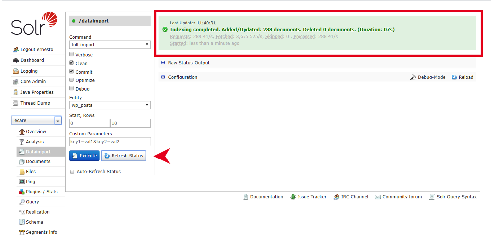

# Características de una FAQ:

1. Propuesta de título
2. Abstract (resumen, ideal un párrafo)
2. Procedimiento (paso a paso, generalmente con carrusel de imágenes)
3. Quizás te podría ayudar (Sección personalizada con faqs que se eligen "a mano")
4. Compartir por email (zona superior)
5. Sección Quizás también te pueda ayudar (autogenerada)
6. Variantes de entrenamiento (opcional, ayuda a refinar búsqueda) 


A veces está la sección de “Te podría interesar” que también es "a mano"


Todas las faqs se crean como páginas de wordpress para que las pueda manejar Contenidos y se utiliza el template de Módulos anidados. No se puede tener dos tipos de módulos en una misma faq, así que se debe revisar los recursos enviados para tener una idea de cuál puede servir mejor. 


#### Guía de Módulos

https://xd.adobe.com/view/58603af2-6d50-44da-7694-50a6472578a8-2e51/?fullscreen

*Nota, para los carruseles de paso a paso, siempre tratar de usar el móvil que tiene un teléfono como borde, pero si no se puede, entonces desktop.


# Procesos Post creación de nueva faq

### Crear urls y mensajes correctos para compartir por email - Contenidos

 

El gestor de contenidos realiza el procedimiento de creación de la id para compartir con email, la cual incluye un mensaje personalizado junto a la url corta hacia la faq.

Ejemplo de excel completo con datos del compartir por email de cada faq:

| Id Compartir por email | URL | Texto Compartir por Mail | URL Corta | ID URL Corta |
|-|-|-|-|-|
| 4171 | https://atencionalcliente.movistar.cl/television/como-funciona-el-deco-movistar-tv | Cómo funciona el Deco Movistar TV? | http://mvch.cl/ecTNt | 53626 |


Para probar que todo esté en orden se puede acceder a la Url de las ventanas emergentes. Esta es la url para hacer las pruebas del compartir por email:
    [https://mvch.cl/mail/index.php/email/?id=4076](https://mvch.cl/mail/index.php/email/?id=4076)    

Cuando nos entreguen los ID se cambia en la url para chequear.

### ¿Cómo se crean estas ventanas?
En una plataforma especial donde se puede ver un listado con las ids de email y también de urls cortas.

(solicitar credenciales) 
[http://mvch.cl/admin/usuarios/login](http://mvch.cl/admin/usuarios/login) 


1. Se genera una url corta hacia un faq específico (o página cualquiera)

2. se genera un nuevo mensaje que incluye el específico por faq y se suma la url corta que creamos anteriormente. Se guarda y esto genera una id específica con el mensaje completo.

3. Se utiliza esa id de mensaje para redirigir los links de compartir por email en el código de pre y Pro.


**El flujo en breve:** como nos van a devolver las id, significa que ya están hechas, entonces podemos cambiar las id ahí y ver cómo queda aún cuando falte el paso de emparejar id con faq en pro

Este proceso se hace en tres partes: 
* Excels con mensajes se reciben de gestoras, se envía eso para ser llenado con datos por parte de contenidos.
* Luego, devuelven la id de cada mensaje listo. 
* Las id’s se envían a dev para que las actualice en el sitio web.

## Cómo se actualiza la id para cada faq - dev

Para agregar los parámetros correctos al botón compartir por email hay que agregar los ids de la ventana de compartir por email en un archivo javascript. Los ids se agregan específicamente a un arreglo JS en:

`wp-content/themes/movistar/js/compartir_js.js`

Para cada ambiente sería:

1. PRE: https://ecare.fusionadns.cl/wp-content/themes/movistar/js/compartir_js.js
2. PRO: https://atencionalcliente.movistar.cl/wp-content/themes/movistar/js/compartir_js.js

Básicamente es pushear la url hacia la faq + id, por ejemplo, un caso  es
url: ::/television/como-funciona-el-deco-movistar-tv/::
id: ::4171::

En resumen, sería esta línea:
```
arrPaginas8165.push({'buscador': '/television/como-funciona-el-deco-movistar-tv/','id_compartir' :4171});
```

Con esto agregado, ya deberían estar funcionando las ventanas de compartir por email en los dos ambientes.


## Actualización de buscador

Un último paso relevante al crear faqs nuevas (o bien agregar variantes de búsqueda), es recordar realizar una actualización al motor de búsqueda (Solr). 

El solr se actualiza en:
https://atencionalcliente.movistar.cl:8983/solr/
(soliciar credenciales)

Para poder acceder al panel de solr es necesario realizar los siguientes pasos:

1.	Conectarte a la vpn de fusiona (mediante las credenciales)
2.	Ingresar a https://atencionalcliente.movistar.cl:8983/solr/ (pro)
 


3.	Una vez en el panel debes seleccionar el core de “ecare”, el cual se ve al desplegar la lista. 
 


4.	Una vez seleccionado el core debe ingresar a la opción de “Dataimport”, y ahí verificar que esten en check las opciones “clean” y “commit” seleccionar la entidad “wp_posts” y presionar el botón de “Execute”. 
 


5.	Luego de unos 5-10 segundos de haber hecho clic en “Execute” puede hacer clic en “Refresh Status” para ver el resultado de la indexación, aparecerá una caja verde con el número de documentos (faqs) asociados, en ese numero no se incluyen las variantes. 
 

6.	Con eso realizado termina el proceso de Actualización del buscador, que en resumen se encarga de agregar las nuevas faqs con las variantes y eliminar las que ya no estén en estado de publicas (borrador, privado, papelera). 


## Variantes de entrenamiento en las faqs (pages) - Contenidos
Muy parecido al concepto de SEO, son palabras o frases para alimentar al buscador interno de la plataforma. Con esto además del título, descripción y tags al buscar también toma en cuenta estas variantes permitiendo una especie de búsqueda lateral con términos que quizás están relacionados, pero no necesariamente son los principales para gatillar la búsqueda.

Esto se realiza al interior de la faq (página).


## Cambiar urls de faqs o redireccionar Faqs antiguas 

Para realizar un cambio de url se necesitar proceder en dos pasos: primero crear una url nueva clonando la faq vieja que estamos trabajando para que sea la páginas oficial.

*Recordar asignar en la faq nueva la misma categoría que tiene la antigua.*

Por último, redireccionamos la página antigua a la nueva por si acaso se busca alguna vez la url vieja, esto se hace cambiando el template de la faq, se elige el de redirección y también agregando los datos necesarios en el panel de redirección, básicamente, la url a la que debe redirigir.

También se debe proceder con los pasos posteriores a la creación de una faq.

*categoría: página madre. En este caso, debería ser la misma que tiene la otra.

## Bitácora

Se trata de un módulo que permite registrar comentarios en las faqs (páginas), a modo de bitácora.

1. Para registrar un comentario en la bitácora de la faq debemos entrar en una faq en modo de edición, ir a la sección bitácora, presionar el botón de agregar comentario, llenar los campos de fecha, homologado con pro y el comentario, luego actualizar la faq. 


2. Una vez que la faq tenga registros de bitácora estos aparecerán en un listado dentro del módulo, que permitirá editarlo o eliminarlo, a su vez podremos ingresar más comentarios haciendo clic igualmente en el botón "agregar comentario".


3. Se puede ver el último registro de la bitácora en el listado de páginas.


4. También se pueden acceder a todos los registros de todas las FAQ en el "Listado Bitácora". 


*Pendientes: Mapas de calor y Análisis Post Cambios FAQ*

